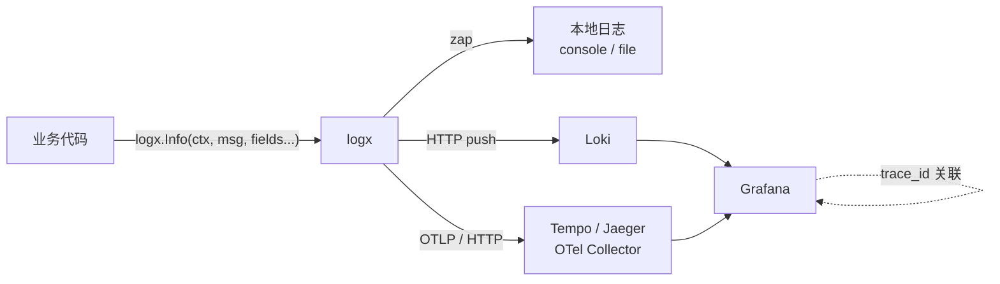

# logx

<p>
  <a href="https://pkg.go.dev/github.com/itmisx/logx"></a>
  <a href="https://golang.org"></a>
  <a href="./LICENSE"></a>
</p>

基于 [uber-go/zap](https://github.com/uber-go/zap) 与 [OpenTelemetry](https://opentelemetry.io/) 的 Go 日志与链路追踪库。
一次调用同时写入**本地日志**、**Loki** 和**链路追踪的 span event**，三者通过 `trace_id` 自动关联。

## 目录

- [特性](#特性)
- [架构](#架构)
- [安装](#安装)
- [快速开始](#快速开始)
- [配置](#配置)
- [日志等级](#日志等级)
- [核心用法](#核心用法)
- [链路传递](#链路传递)
- [优雅退出](#优雅退出)
- [后端对接](#后端对接)
- [API 参考](#api-参考)
- [注意事项](#注意事项)
- [License](#license)

## 特性

- **一次调用，三处落地** —— 本地日志、Loki 推送、span event 由同一个 API 完成
- **日志与链路自动关联** —— 日志自动携带 `trace_id` / `span_id`，可在 Grafana 中从 trace 一键跳转到日志
- **五级日志等级** —— `debug` / `info` / `warn` / `error` / `fatal`，支持运行时动态调整
- **通用 OTLP 导出** —— 可对接 Tempo、Jaeger、OpenTelemetry Collector 及各类兼容后端
- **日志文件切分** —— 基于 [lumberjack](https://github.com/natefinch/lumberjack)，支持按大小切分与 cron 定时切分
- **跨服务链路传递** —— 内置 HTTP 注入与 Gin 中间件，也支持手动构造根 context
- **异常自动恢复** —— `defer logx.End(ctx)` 同时完成 span 结束与 panic 恢复

## 架构



## 安装

```bash
go get -u github.com/itmisx/logx
```

要求 Go 1.24 及以上。

## 快速开始

```go
package main

import (
    "context"

    "github.com/itmisx/logx"
)

func main() {
    logx.Init(logx.Config{
        Level:  "info",
        Output: "console", // 注意：默认为 none，不输出任何日志

        // 开启链路追踪并导出到本地 Tempo / Jaeger
        EnableTrace:      true,
        TraceSampleRatio: 1,
        OTLPEndpoint:     "localhost:4318",
        OLTPInsecure:     true,
    }, "my-service", logx.String("service.version", "v1.0.0"))

    // 进程退出前导出缓存中的 span
    defer logx.Shutdown(context.Background())

    foo(context.Background())
}

func foo(ctx context.Context) {
    // 启动一个 span，必须配套 defer End
    ctx = logx.Start(ctx, "foo", logx.String("biz", "demo"))
    defer logx.End(ctx)

    logx.Info(ctx, "处理开始", logx.Int("user_id", 1001))

    if err := doSomething(ctx); err != nil {
        logx.Error(ctx, "处理失败", logx.Err(err))
        return
    }

    logx.Info(ctx, "处理完成")
}
```

## 配置

### 日志输出

| 字段 | 类型 | 默认值 | 说明 |
| --- | --- | --- | --- |
| `Level` | `string` | 由 `Debug` 推导 | 日志等级，`debug` / `info` / `warn` / `error` / `fatal` |
| `Output` | `string` | `none` | 输出方式，`none` 不输出、`console` 输出到控制台、`file` 输出到文件 |
| `Debug` | `bool` | `false` | **已废弃**，请使用 `Level`。仅在 `Level` 为空时生效 |

> `Output` 默认为 `none`，即**不输出任何本地日志**。需要本地日志时必须显式设置。

### 日志文件与切分

仅在 `Output` 为 `file` 时生效。

| 字段 | 类型 | 默认值 | 说明 |
| --- | --- | --- | --- |
| `File` | `string` | `./logs/run.log` | 日志文件路径 |
| `MaxSize` | `int` | `100` | 单个日志文件大小上限，单位 MB，超过后触发切分 |
| `MaxBackups` | `int` | `15` | 保留的切分文件数量上限，超出的被删除 |
| `MaxAge` | `int` | `7` | 切分文件保留天数，超出的被删除 |
| `Compress` | `bool` | `false` | 是否对切分后的文件做 gzip 压缩 |
| `Rotate` | `string` | 空 | 定时切分的 cron 表达式，精确到秒，如 `0 0 0 * * *` 表示每天零点 |

### Loki 推送

| 字段 | 类型 | 默认值 | 说明 |
| --- | --- | --- | --- |
| `LokiServer` | `string` | 空 | Loki 的 push 地址，如 `http://localhost:3100/loki/api/v1/push`。为空则不推送 |
| `LokiUsername` | `string` | 空 | Basic Auth 用户名 |
| `LokiPassword` | `string` | 空 | Basic Auth 密码 |

服务名与 `Init` 传入的字符串型应用属性会作为 Loki label 上报，label 名需匹配 `^[0-9A-Za-z_]+$`，含 `.` 的属性（如 `service.version`）会被过滤。

### 链路追踪

| 字段 | 类型 | 默认值 | 说明 |
| --- | --- | --- | --- |
| `EnableTrace` | `bool` | `false` | 追踪总开关。关闭时 `Start` 返回 noop span |
| `TracerProviderType` | `string` | `oltp` | 导出方式，`oltp` 走 OTLP/HTTP、`file` 写入本地 `trace.txt` |
| `TraceSampleRatio` | `float64` | `0` | 采样率，取值 `0.0`–`1.0`。`0` 为不采样，`1` 为全量采样 |
| `OTLPEndpoint` | `string` | `localhost:4318` | OTLP 地址，格式为 `host:port`，**不含 scheme 和 path** |
| `OTLPEndpointURLPath` | `string` | `/v1/traces` | OTLP 的 URL path |
| `OLTPInsecure` | `bool` | `false` | 为 `true` 时使用 HTTP，默认使用 HTTPS |
| `OTLPToken` | `string` | 空 | Basic Auth token，非空时作为 `Authorization: Basic <token>` 请求头发送 |

## 日志等级

等级由低到高为 `debug` < `info` < `warn` < `error` < `fatal`，低于配置等级的日志会被丢弃，且**同时作用于本地日志、Loki 推送和 span event**。

```go
logx.Init(logx.Config{Level: "info"}, "my-service")

// 运行时动态调整，并发安全，无需重启
logx.SetLevel("debug")
logx.GetLevel() // "debug"
```

- `fatal` 为最高等级，不受过滤，任何配置下都会被记录
- 等级值大小写不敏感，`warning` 为 `warn` 的别名
- 无法识别的等级会打印一条告警并回退为 `info`
- `Level` 为空时由已废弃的 `Debug` 字段推导：`true` 等价于 `debug`，`false` 等价于 `error`

## 核心用法

### span 的生命周期

```go
func handle(ctx context.Context) {
    // Start 创建 span 并返回携带 span 的新 context
    // 第三个参数起为 span 的附加属性
    ctx = logx.Start(ctx, "handle", logx.String("key", "value"))
    // End 结束 span 并恢复 panic，必须 defer，否则会造成 span 泄露
    defer logx.End(ctx)

    // 后续调用传入该 ctx，日志才能挂到这个 span 上
    logx.Info(ctx, "message", logx.Int("count", 3))
}
```

将 `Start` 返回的 ctx 传给下一层，即可形成父子 span：

```go
parent := logx.Start(context.Background(), "parent")
defer logx.End(parent)

child := logx.Start(parent, "child") // child 的父 span 为 parent
defer logx.End(child)
```

### 记录日志

```go
logx.Debug(ctx, "调试信息", logx.Any("payload", obj))
logx.Info(ctx, "普通信息", logx.String("user", "alice"))
logx.Warn(ctx, "警告信息", logx.Int("retry", 2))
logx.Error(ctx, "错误信息", logx.Err(err))  // 在 span 上记为 exception
logx.Fatal(ctx, "致命错误")                  // 记录后以退出码 1 结束进程
```

映射关系：

| 方法 | 本地日志 | Loki | 链路追踪 |
| --- | --- | --- | --- |
| `Debug` / `Info` / `Warn` | zap 对应等级 | 对应 level label | `span.AddEvent` |
| `Error` | `error` | `error` | `span.RecordError`（OTel exception 语义） |
| `Fatal` | `fatal` | `fatal` | `span.RecordError` + 强制导出 + 退出进程 |

### 动态补充 span 属性

```go
ctx = logx.Start(ctx, "query")
defer logx.End(ctx)

// 在 span 执行过程中追加属性
logx.SetSpanAttr(ctx, logx.Int("rows", len(rows)))
```

### 获取 trace 标识

```go
logx.TraceID(ctx) // 当前 trace 的 ID
logx.SpanID(ctx)  // 当前 span 的 ID
```

本地日志与 Loki 推送会自动携带 `trace_id` 与 `span_id` 字段，无需手动添加。

## 链路传递

跨进程传递的本质是把 `trace_id` 与 `span_id` 通过载体带到下游。

### HTTP 客户端注入

```go
func post(ctx context.Context) error {
    req, err := http.NewRequest("POST", url, body)
    if err != nil {
        return err
    }
    // 将当前 span 信息注入请求头
    if err := logx.HttpInject(ctx, req); err != nil {
        return err
    }
    _, err = http.DefaultClient.Do(req)
    return err
}
```

### Gin 服务端提取

```go
router := gin.New()
// 参数为当前服务名，中间件会从请求头提取上游 span 信息
router.Use(logx.GinMiddleware("my-service"))

func handler(c *gin.Context) {
    // 从 c.Request.Context() 取出上游 context，生成的 span 即为子 span
    ctx := logx.Start(c.Request.Context(), "handler")
    defer logx.End(ctx)

    logx.Info(ctx, "received")
}
```

> 需要自定义 propagator 或 tracer provider 时，可直接使用
> `github.com/itmisx/logx/propagation/extract` 下的 `GinMiddleware(service, extract.WithPropagators(...))`。

### 手动构造根 context

适用于无法通过函数参数或请求头传递的场景，例如消息队列消费、定时任务。

```go
// ID 可由上游传递，也可由本地生成
traceID := logx.GenTraceID()
spanID := logx.GenSpanID()

ctx, err := logx.NewRootContext(traceID, spanID)
if err != nil {
    return err
}

// 基于该 ctx 创建的 span 会挂在传入的 trace 下
ctx = logx.Start(ctx, "consume")
defer logx.End(ctx)
```

## 优雅退出

追踪数据由 `BatchSpanProcessor` 批量异步导出，进程直接退出会丢失缓冲区中的 span。

```go
logx.Init(conf, "my-service")
defer logx.Shutdown(context.Background()) // 导出缓存并关闭 provider
```

| 方法 | 说明 |
| --- | --- |
| `Flush(ctx) error` | 立即导出缓存中的 span，不关闭 provider |
| `Shutdown(ctx) error` | 导出缓存中的 span 并关闭 provider |

两者在未开启追踪时均为空操作，直接返回 `nil`，调用方无需判断配置。

## 后端对接

### 本地 Jaeger

Jaeger 自 v1.35 起原生支持 OTLP 摄取，v1.49 及以上默认开启。

```yaml
services:
  jaeger:
    image: jaegertracing/all-in-one:1.57
    environment:
      - COLLECTOR_OTLP_ENABLED=true # v1.49+ 默认已开启
    ports:
      - "16686:16686" # UI
      - "4318:4318"   # OTLP/HTTP
```

```go
logx.Config{
    EnableTrace:      true,
    TraceSampleRatio: 1,
    OTLPEndpoint:     "localhost:4318",
    OLTPInsecure:     true, // 本地为纯 HTTP，必须开启
    // OTLPEndpointURLPath 留空即为 /v1/traces，与 Jaeger 一致
}
```

访问 `http://localhost:16686`，按 `Init` 传入的服务名检索即可。

### Loki + Tempo + Grafana

完整的 docker-compose 示例见 [`example/grafana`](./example/grafana)。

```go
logx.Config{
    Output:           "console",
    LokiServer:       "http://localhost:3100/loki/api/v1/push",
    EnableTrace:      true,
    TraceSampleRatio: 1,
    OTLPEndpoint:     "localhost:4318",
    OLTPInsecure:     true,
}
```

在 Grafana 的 Loki 数据源中配置 derived field，用 `trace_id` 指向 Tempo 数据源，即可从日志跳转到完整链路。

### Grafana Cloud

```go
logx.Config{
    EnableTrace:         true,
    TraceSampleRatio:    0.1,
    OTLPEndpoint:        "otlp-gateway-prod-ap-southeast-1.grafana.net",
    OTLPEndpointURLPath: "/otlp/v1/traces",
    OTLPToken:           "<base64(instanceID:token)>",
}
```

## API 参考

### 初始化与生命周期

| 函数 | 说明 |
| --- | --- |
| `Init(conf Config, serviceName string, attrs ...Field)` | 初始化。`serviceName` 会写入 span 的 `service.name` 与 Loki 的 `service_name` label |
| `Flush(ctx context.Context) error` | 立即导出缓存中的 span |
| `Shutdown(ctx context.Context) error` | 导出缓存并关闭 provider |

### 日志等级

| 函数 | 说明 |
| --- | --- |
| `SetLevel(level string)` | 运行时调整日志等级，并发安全 |
| `GetLevel() string` | 返回当前日志等级 |

### 日志记录

| 函数 | 说明 |
| --- | --- |
| `Debug(ctx, msg string, attrs ...Field)` | 调试日志 |
| `Info(ctx, msg string, attrs ...Field)` | 普通日志 |
| `Warn(ctx, msg string, attrs ...Field)` | 警告日志 |
| `Error(ctx, msg string, attrs ...Field)` | 错误日志，在 span 上记为 exception |
| `Fatal(ctx, msg string, attrs ...Field)` | 致命错误，记录后以退出码 1 结束进程 |

### 链路追踪

| 函数 | 说明 |
| --- | --- |
| `Start(ctx, spanName string, attrs ...Field) context.Context` | 创建 span，返回携带该 span 的 context |
| `End(ctx context.Context)` | 结束 span 并恢复 panic，需 `defer` 调用 |
| `SetSpanAttr(ctx, attrs ...Field)` | 为当前 span 追加属性 |
| `TraceID(ctx) string` / `SpanID(ctx) string` | 获取当前 trace / span 的 ID |
| `GenTraceID() string` / `GenSpanID() string` | 生成合法的 trace / span ID |
| `NewRootContext(traceID, spanID string) (context.Context, error)` | 由指定 ID 构造根 context |

### 链路传递

| 函数 | 说明 |
| --- | --- |
| `HttpInject(ctx, req *http.Request) error` | 将 span 信息注入 HTTP 请求头 |
| `GinMiddleware(service string) gin.HandlerFunc` | Gin 中间件，从请求头提取上游 span 信息 |

### Field 类型

```go
logx.Bool("ok", true)
logx.Int("age", 30)
logx.Int64("id", 1001)
logx.Float64("score", 99.5)
logx.String("name", "alice")
logx.Stringer("addr", addr)      // 任意实现 fmt.Stringer 的类型
logx.Any("payload", obj)         // 任意类型，在 span 属性中序列化为 JSON 字符串
logx.Err(err)                    // 固定使用 error 作为 key
```

`Bool` / `Int` / `Int64` / `Float64` / `String` 均提供对应的切片版本：`BoolSlice`、`IntSlice`、`Int64Slice`、`Float64Slice`、`StringSlice`。

## 注意事项

- **`Start` 必须配套 `defer End`**。缺少 `End` 会导致 span 既不结束也不导出，并持续占用内存。
- **采样率会影响 span event**。`TraceSampleRatio` 设为 `0.1` 时，约 90% 的 span 及其 event 不会上报，而 Loki 推送不受采样影响、始终为全量。需要完整日志检索能力时应同时配置 Loki。
- **单个 span 的 event 数量有上限**。OpenTelemetry SDK 默认每个 span 最多 128 个 event，超出部分会被静默丢弃。长生命周期的 span 应拆分为多个子 span。
- **没有 span 的 ctx 不会产生 event**。未经 `Start` 的 context（如进程启动阶段、未传递 ctx 的定时任务）调用日志方法时，本地日志和 Loki 正常写入，但不会产生 span event。
- **`Fatal` 会结束进程**。它会先记录 span、推送 Loki、强制导出追踪数据，然后以退出码 `1` 退出，其后的代码不会执行。
- **传播格式为 W3C Trace Context**。开启 OTLP 追踪时使用 `TraceContext` + `Baggage`；若上游服务使用 B3 格式传递，链路会在此处断开。
- **`TracerProviderType` 配置了不支持的值会导致进程退出**（`log.Fatal`），仅接受 `oltp` 与 `file`。

## 效果预览

基于 Loki + Tempo + Grafana 的日志查询与链路追踪：


## License

本项目基于 [MIT License](./LICENSE) 开源。
